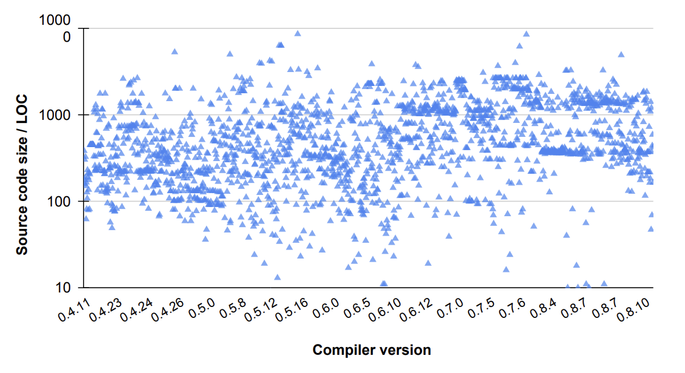

# EthSema - Binary translator for Ethereum 2.0

EthSema is a novel EVM-to-eWASM bytecode translator that can not only ensure the fidelity of translation but also fix commonly-seen vulnerabilities in smart contracts. 

Since millions of smart contracts have been deployed and running on Ethereum 1.0, it is highly desirable to convert their EVM bytecode to eWASM bytecode automatically to foster the prosperity of Ethereum ecosystem. EthSema can translate existing EVM bytecode to eWASM smart contracts which can be executed in the [Ethereum 2.0 ecosystem](https://ethereum.org/en/upgrades/). To evaluate its performance, we download real-world contracts and their transactions from the Ethereum blockchain, replay them on our testnet, and compare the traces of the EVM transactions and eWASM transactions. The experimental demonstrate that EthSema can ensure the semantic correctness of the converted eWASM contracts. 

## Comparison with other machine code to LLVM bitcode lifters

| Tool                                                 | Bytecode | CFG       | EEI       | ECI       | Hardness |
| ---------------------------------------------------- | -------- | --------- | --------- | --------- | -------- |
| [SOLL](https://github.com/second-state/SOLL)         | no       | partial   | partial   | partial   | no       |
| [Solang](https://github.com/hyperledger-labs/solang) | no       | partial   | partial   | partial   | no       |
| [evm2wasm](https://github.com/ewasm/evm2wasm)        | yse      | incorrect | partial   | incorrect | no       |
| [EVMJIT](https://github.com/ethereum/evmjit)         | yes      | partially | incorrect | incorrect | no       |
| EthSema                                              | yes      | fully     | fully     | fully     | yes      |

## Current Status 

- **RQ1: Effectivess**

**Real-world Benchmark:** We collect 1,983 real-world EVM bytecode from [Etherscan](https://etherscan.io/). The below figure shows the profile of each smart contract, where the x-axis is the Solidity version and the y-axis is the size of source code. These contracts have 741 LOC on average, and the largest one contains over 8,500 LOC. 

Dataset is in In `./benchmarks/onchain/evm`



ETHSEMA can successfully convert EVM contracts into eWASM contracts and outperform the Solidity-based baselines.

| Tool    | # Passed           | avg.Size / KB | avg.Time / ms |
| ------- | ------------------ | ------------- | ------------- |
| EthSema | **1,983 (100.0%)** | 271.6         | 4579.0        |
| SOLL    | 18 (0.9%)          | 6.5           | 181.4         |
| Solang  | 117 (5.9%)         | 11.5          | 2.8           |

----

**Synthetic Benchmark**

In `./benchmarks/Synthetic`

- **RQ2: Correctness**

**Real-world Benchmark:** we exclude some contracts because they depend on libc (standard C library, e.g., \_\_multi3, __shrl3) that the Ethereum 2.0 runtime does not support yet.  For each contract, we collect the fist 20 transactions sent to them. Eventually, we replay 12,048 transactions at our testbed for evaluation the correctness of ETHSEMA.

We instrument EVM and eWASM runtime and replay 12,048 real-world transactions to compare the difference of the transactions traces, which covers most of operations that are associated with blockchain states, including storage accesses (*SLOAD, SSTORE*), external calls (CALL, STATICCALL, DELEGATECALL), emitting events (*LOG0-4*), contract suicide (SELFDESTRUCT) and returning values (*RETURN*).

| Tool    | Contracts #1,165  | Transactions #12,048 | Score |
| ------- | ----------------- | -------------------- | ----- |
| EthSema | **1,125 (96.6%)** | 12,048 (100%)        | 0.99  |
| SOLL    | 7 (0.60%)         | 15 (0.12%)           | 0.68  |
| Solang  | 23 (1.97%)        | 42 (0.35%)           | 0.67  |

ETHSEMA can ensure the semantic correctness of the converted eWASM contracts.

**Note:** more experimental results will be public after this paper is accepted.

## Dependencies

| Name   | Version      |
| ------ | ------------ |
| git    | Latest       |
| CC     | gcc-7        |
| CXX    | g++-7        |
| cmake  | 3.20.0       |
| LLVM   | 10.0         |
| Ubuntu | 18.04, 20.04 |

## Getting and building the code

We have provided the pre-built binaries in the `./bin/`. 

In addtion, you can build `Ethsema` from the source code.

```sh
./script/install_cmake.sh # install cmake 3.20.0
sudo apt-get update && apt-get install gcc-7 apt-get install g++-7 -y
export CC=/usr/bin/gcc-7
export CXX=/usr/bin/g++-7

sudo ln -s /usr/bin/python2.7 /usr/bin/python # link python if your are at ubuntu 20.04
mkdir build && cd build
cmake -DBUILD_SHARED_LIBS=ON .. 
cmake --build . --target evmtrans
```

# Getting Started

Here is an simple example, which can be exploited by an reentrancy attacker.

```solidity
pragma solidity ^0.8.11;

contract reEntrancy {
  mapping(address => uint256) public balances;

  constructor(uint256 airtoken){
    balances[msg.sender] = airtoken;
  }

  function depositFunds() public payable {
      balances[msg.sender] += msg.value;
  }
  function withdrawFunds (uint256 _weiToWithdraw) public payable {
    require(balances[msg.sender] >= _weiToWithdraw);
    (bool success, ) = msg.sender.call{value: _weiToWithdraw, gas:gasleft()}(abi.encodeWithSignature("any()") );
    require(success);
    unchecked { 
        balances[msg.sender] -= _weiToWithdraw;
    }
    }
}
```

## Translate EVM bytecode to eWASM

- EVM bytecode

  When we are going to deploy the EVM contract with `uint256 airtoken = 0x10` as the constructor argument, EVM will receive the below code and execute it for deployment.

  ```
  608060405234801561001057600080fd5b506040516105fe3803806105fe833981810160405281019061003291906100b6565b806000803373ffffffffffffffffffffffffffffffffffffffff1673ffffffffffffffffffffffffffffffffffffffff16815260200190815260200160002081905550506100e3565b600080fd5b6000819050919050565b61009381610080565b811461009e57600080fd5b50565b6000815190506100b08161008a565b92915050565b6000602082840312156100cc576100cb61007b565b5b60006100da848285016100a1565b91505092915050565b61050c806100f26000396000f3fe6080604052600436106100345760003560e01c8063155dd5ee1461003957806327e235e314610055578063e2c41dbc14610092575b600080fd5b610053600480360381019061004e91906102de565b61009c565b005b34801561006157600080fd5b5061007c60048036038101906100779190610369565b610234565b60405161008991906103a5565b60405180910390f35b61009a61024c565b005b806000803373ffffffffffffffffffffffffffffffffffffffff1673ffffffffffffffffffffffffffffffffffffffff1681526020019081526020016000205410156100e757600080fd5b60003373ffffffffffffffffffffffffffffffffffffffff16825a906040516024016040516020818303038152906040527fe4608b73000000000000000000000000000000000000000000000000000000007bffffffffffffffffffffffffffffffffffffffffffffffffffffffff19166020820180517bffffffffffffffffffffffffffffffffffffffffffffffffffffffff8381831617835250505050604051610193919061043a565b600060405180830381858888f193505050503d80600081146101d1576040519150601f19603f3d011682016040523d82523d6000602084013e6101d6565b606091505b50509050806101e457600080fd5b816000803373ffffffffffffffffffffffffffffffffffffffff1673ffffffffffffffffffffffffffffffffffffffff168152602001908152602001600020600082825403925050819055505050565b60006020528060005260406000206000915090505481565b346000803373ffffffffffffffffffffffffffffffffffffffff1673ffffffffffffffffffffffffffffffffffffffff168152602001908152602001600020600082825461029a9190610480565b92505081905550565b600080fd5b6000819050919050565b6102bb816102a8565b81146102c657600080fd5b50565b6000813590506102d8816102b2565b92915050565b6000602082840312156102f4576102f36102a3565b5b6000610302848285016102c9565b91505092915050565b600073ffffffffffffffffffffffffffffffffffffffff82169050919050565b60006103368261030b565b9050919050565b6103468161032b565b811461035157600080fd5b50565b6000813590506103638161033d565b92915050565b60006020828403121561037f5761037e6102a3565b5b600061038d84828501610354565b91505092915050565b61039f816102a8565b82525050565b60006020820190506103ba6000830184610396565b92915050565b600081519050919050565b600081905092915050565b60005b838110156103f45780820151818401526020810190506103d9565b83811115610403576000848401525b50505050565b6000610414826103c0565b61041e81856103cb565b935061042e8185602086016103d6565b80840191505092915050565b60006104468284610409565b915081905092915050565b7f4e487b7100000000000000000000000000000000000000000000000000000000600052601160045260246000fd5b600061048b826102a8565b9150610496836102a8565b9250827fffffffffffffffffffffffffffffffffffffffffffffffffffffffffffffffff038211156104cb576104ca610451565b5b82820190509291505056fea26469706673582212205169030a0b1fb28c11d2e78958d863d2beaeeb2b8cb3b0295530ceb6408fcfeb64736f6c634300080b00330000000000000000000000000000000000000000000000000000000000000010
  ```

- eWASM generation

  we save the above hex bytecode into `tmp.hex` and run EthSema to get eWASM code.

  ```bash
  cat tmp.hex | xxd -r -ps > .tmp.bin && /path/to/standalone-evmtrans /path/to/out # replace the path, pls
  ```

  Also we can fix the reentrancy vulnerability using this cmd.

  ```bash
  cat tmp.hex | xxd -r -ps > .tmp.bin && /path/to/standalone-evmtrans /path/to/out --check-reentrancy # replace the path, pls
  ```

- LLVM Bitcode Generation

  ```bash
  cat tmp.hex | xxd -r -ps > .tmp.bin && /path/to/standalone-evmtrans /path/to/out --dump
  ```

  `./res.ll` is the LLVM bitcode for the entire smart contract

  `./rt.ll` is the LLVM bitcode for the runtime code of the smart contracts. See this for more details about the [EVM bytecode structure](https://ethereum.stackexchange.com/questions/76334/what-is-the-difference-between-bytecode-init-code-deployed-bytedcode-creation).

## Execute WASM smart contract

**testnet: geth + Hera**

We build a testnet with a [geth](https://github.com/Kenun99/go-ethereum) node, which uses [Hera](https://github.com/Kenun99/hera)  as the eWASM VM and maintains the compatibility to EVM. The geth equipped with dual interpreters can execute smart contracts in EVM bytecode or eWASM bytecode on our testnet via uniform interfaces. In our paper, we further extended Hera to support all Ethereum interfaces introduced from the latest “London” upgrade [62], such as CREATE2, SELFBALANCE, CHAINID, BASEFEE and COINBASE.  

```bash
$ git clone https://github.com/Kenun99/ethsema.git && cd ethsema
$ docker build -t localhost/client-go:ewasm .
$ ./scripts/ewasm.sh # run the ewasm node
```

**One step to test**

[example.py](https://github.com/Kenun99/ethsema/blob/main/example.py) uses an EVM smart contract to exploit the reentrancy vulnerability in the eWASM code.

Requirement: Python3.8, Solc-x, web3py

```bash
$ python3 -m venv ./venv && source ./venv/bin/activate && python -m pip install -r requirements.txt
$ python example.py
```

More tests

```bash
$ source ./venv/bin/activate # activate virtual environment
$ ./scripts/test.sh
```


## License

[MIT](https://github.com/Kenun99/ethsema/blob/main/LICENSE)